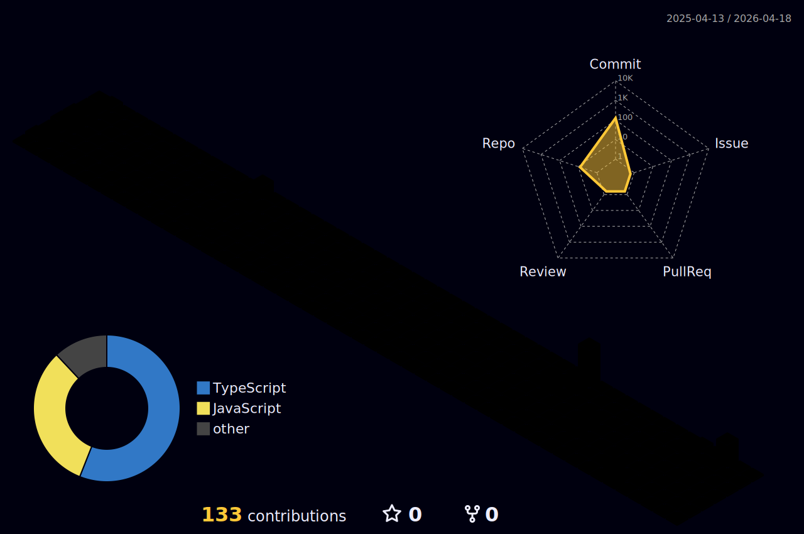

# Hi, I'm Santiago Hernández 👋

**Fullstack Developer | Tech Enthusiast**

I'm a software development technician based in Mendoza, Argentina, with hands-on experience in web development, system optimization, and team coordination. Currently pursuing a  **Technical Degree in Software Development**.

*Always looking to solve problems, learn new tech, and build great software.* ✨

<h2> Tech Stack  </h2>

 
# 📊 GitHub Stats:

# Get In Touch With Me

